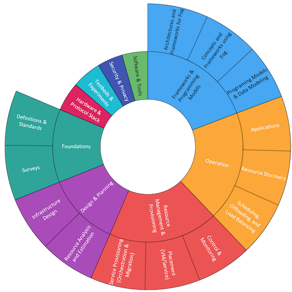

# fog-survey-data

----

The datasets of the survey paper: 
[All One Needs to Know about Fog Computing and Related Edge Computing Paradigms: A Complete Survey](https://arxiv.org/abs/1808.05283);
Ashkan Yousefpour, Caleb Fung, Tam Nguyen, Krishna Kadiyala, Fatemeh Jalali, Amirreza Niakanlahiji, Jian Kong, Jason P. Jue

----



----
----

## Datasets

Here are explanation of the datasets.

### 1. Papers
```
Papers.csv
```
This file contains the reference to the papers along with their conference/journal information, in "Chicago" style. For instance:

[183]	Perera, Charith, Yongrui Qin, Julio C. Estrella, Stephan Reiff-Marganiec, and Athanasios V. Vasilakos. "Fog computing for sustainable smart cities: A survey." ACM Computing Surveys (CSUR) 50, no. 3 (2017): 32.

### 2. Category of Papers
```
Paper-Categories.csv
```
This file contains the category of the papers. A paper may belong to more than one category. (Table 4 in the [paper](https://arxiv.org/abs/1808.05283))


### 3. Objectives or Features of Papers
```
Paper-Objectives/Features.csv
```
This file contains the objectives/features of the papers. A paper may have more than one objective/feature. (Table 6 in the [paper](https://arxiv.org/abs/1808.05283))

### 4. Explanation/Examples of Objectives and Features
```
Objectives/Features.csv
```
This file contains the explanation and examples for each objective/feature. (Table 5 in the [paper](https://arxiv.org/abs/1808.05283))

### 5. Number of Papers in each category
```
Number-of-Papers-per-Category.csv
```
This file contains the number of papers in the survey under each category of our proposed taxonomy. (Figure 10 in the [paper](https://arxiv.org/abs/1808.05283))

### 6. Number of Papers addressing each Feature/Objective
```
Number-of-Papers-Addressing-Feature/Objective.csv
```
This file contains the number of papers number in the survey that address/support a particular objective/feature. (Figure 11 in the [paper](https://arxiv.org/abs/1808.05283))